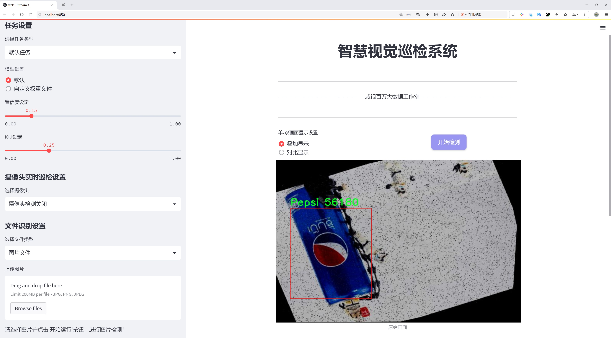
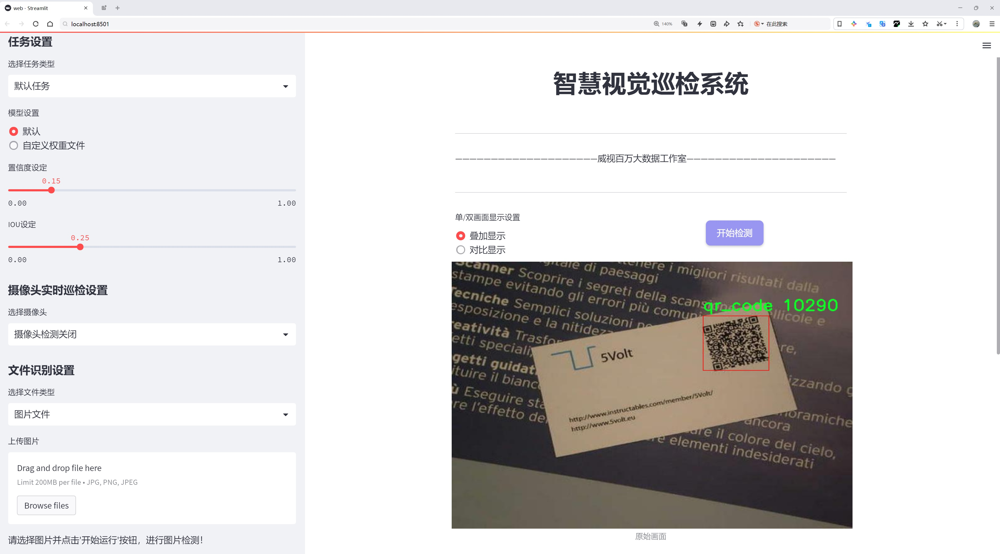
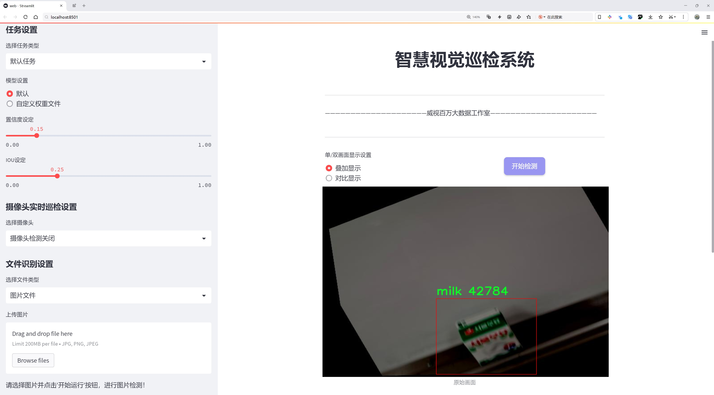
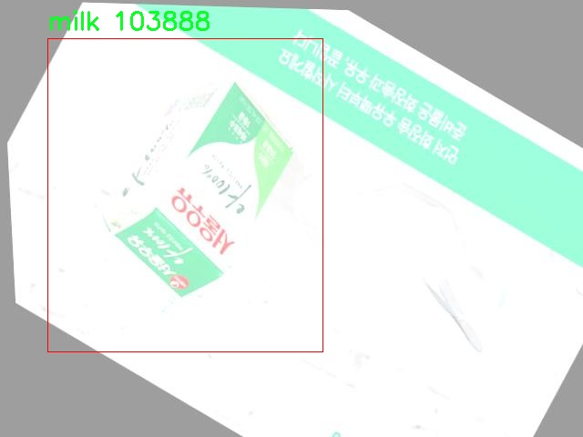
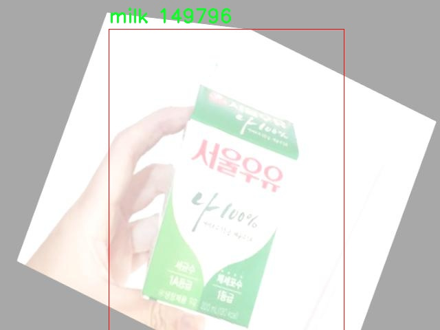

# 市场商品识别检测系统源码分享
 # [一条龙教学YOLOV8标注好的数据集一键训练_70+全套改进创新点发刊_Web前端展示]

### 1.研究背景与意义

项目参考[AAAI Association for the Advancement of Artificial Intelligence](https://gitee.com/qunmasj/projects)

项目来源[AACV Association for the Advancement of Computer Vision](https://github.com/qunshansj/good)

研究背景与意义

随着信息技术的迅猛发展，计算机视觉技术在各个领域的应用日益广泛，尤其是在商品识别和市场分析方面。传统的市场商品识别方法多依赖于人工识别和分类，效率低下且容易受到人为因素的影响。近年来，深度学习技术的快速进步为商品识别提供了新的解决方案，其中基于卷积神经网络（CNN）的目标检测算法尤为突出。YOLO（You Only Look Once）系列算法因其高效的实时检测能力和较高的准确率，逐渐成为商品识别领域的研究热点。

本研究旨在基于改进的YOLOv8模型，构建一个高效的市场商品识别系统。所使用的数据集包含3452张图像，涵盖了8个商品类别，包括Pepsi、Coca-Cola、咖喱、真拉面、牛奶、Pepero杏仁、二维码和Twix。这些商品不仅在市场上具有广泛的应用场景，而且在消费者日常生活中占据重要地位。通过对这些商品的自动识别和分类，能够为市场营销、库存管理、消费者行为分析等提供有力支持。

在市场商品识别的研究中，数据集的质量和多样性直接影响模型的训练效果和识别准确率。我们的数据集包含了多种类商品，涵盖了不同的品牌和包装形式，能够有效地模拟实际市场环境。这为改进YOLOv8模型提供了丰富的训练样本，使其能够在复杂的背景下实现高效的商品识别。此外，数据集中还包含二维码的识别任务，这为研究提供了更为广泛的应用场景，尤其是在现代零售环境中，二维码的普及使得商品信息的获取变得更加便捷。

改进YOLOv8模型的意义在于其能够在保持高准确率的同时，提升检测速度，使得实时商品识别成为可能。这对于快速消费品行业尤为重要，商家可以通过实时数据分析，及时调整市场策略和库存管理，提高运营效率。同时，基于改进YOLOv8的商品识别系统也可以为消费者提供更为个性化的购物体验，例如通过识别商品快速获取相关信息和促销活动，增强消费者的购买决策。

此外，本研究还将探讨如何通过数据增强、模型优化等手段，进一步提升商品识别的鲁棒性和准确性。这不仅有助于推动目标检测技术在商业领域的应用，也为后续相关研究提供了理论基础和实践经验。综上所述，基于改进YOLOv8的市场商品识别系统的研究，不仅具有重要的学术价值，也为实际商业应用提供了切实可行的解决方案，具有广泛的社会和经济意义。

### 2.图片演示







##### 注意：由于此博客编辑较早，上面“2.图片演示”和“3.视频演示”展示的系统图片或者视频可能为老版本，新版本在老版本的基础上升级如下：（实际效果以升级的新版本为准）

  （1）适配了YOLOV8的“目标检测”模型和“实例分割”模型，通过加载相应的权重（.pt）文件即可自适应加载模型。

  （2）支持“图片识别”、“视频识别”、“摄像头实时识别”三种识别模式。

  （3）支持“图片识别”、“视频识别”、“摄像头实时识别”三种识别结果保存导出，解决手动导出（容易卡顿出现爆内存）存在的问题，识别完自动保存结果并导出到tempDir中。

  （4）支持Web前端系统中的标题、背景图等自定义修改，后面提供修改教程。

  另外本项目提供训练的数据集和训练教程,暂不提供权重文件（best.pt）,需要您按照教程进行训练后实现图片演示和Web前端界面演示的效果。

### 3.视频演示

[3.1 视频演示](https://www.bilibili.com/video/BV1B9pFejEze/?vd_source=ff015de2d29cbe2a9cdbfa7064407a08)

### 4.数据集信息展示

##### 4.1 本项目数据集详细数据（类别数＆类别名）

nc: 8
names: ['Pepsi', 'cocacola', 'curry', 'jinramen', 'milk', 'pepero_almonds', 'qr_code', 'twix']


##### 4.2 本项目数据集信息介绍

数据集信息展示

在当今快速发展的市场环境中，商品识别技术的准确性和效率对于零售行业的数字化转型至关重要。为此，我们构建了一个名为“market_detection”的数据集，旨在为改进YOLOv8的市场商品识别系统提供强有力的支持。该数据集包含了8个不同类别的商品，涵盖了广泛的日常消费品，具体类别包括：Pepsi、cocacola、curry、jinramen、milk、pepero_almonds、qr_code和twix。这些类别的选择不仅反映了市场上流行的商品类型，也为模型的训练提供了丰富的样本来源。

在数据集的构建过程中，我们特别注重样本的多样性和代表性。每个类别的商品都通过精心设计的拍摄方案进行捕捉，确保在不同的光照条件、背景环境和拍摄角度下，数据集中的图像能够真实反映实际使用场景。例如，Pepsi和cocacola作为两种广受欢迎的碳酸饮料，它们的包装设计、颜色和标识在不同的市场环境中可能会有所不同，因此我们在数据集中收录了多种不同版本的图像，以提高模型的泛化能力。

此外，数据集中还包含了与商品相关的二维码（qr_code）类别。这一类别的引入，不仅丰富了数据集的内容，也为未来的应用场景提供了更多的可能性。通过识别二维码，系统可以进一步获取商品的详细信息，增强用户体验。这种多层次的识别能力，将使得市场商品识别系统在实际应用中更加智能化和人性化。

在数据标注方面，我们采用了严格的标注标准，确保每个图像中的商品都能被准确地识别和分类。标注团队由经验丰富的专业人员组成，他们对每个类别的特征有深入的理解，从而保证了数据集的高质量和高准确性。每个图像的标注信息都经过多轮审核，以消除潜在的错误和不一致性，确保训练模型时所使用的数据是可靠的。

为了便于后续的模型训练和评估，我们还将数据集划分为训练集、验证集和测试集，确保模型在不同阶段的学习和验证过程中都能获得充分的样本支持。这种划分策略不仅有助于提高模型的训练效率，也能有效避免过拟合现象的发生，使得最终模型在实际应用中具备更强的适应性和准确性。

综上所述，“market_detection”数据集的构建充分考虑了市场商品识别系统的实际需求，通过精心选择商品类别、严格的数据标注和合理的数据划分，为改进YOLOv8模型提供了坚实的基础。随着这一数据集的应用，我们期待在市场商品识别领域取得更为显著的进展，推动零售行业的智能化发展。







### 5.全套项目环境部署视频教程（零基础手把手教学）

[5.1 环境部署教程链接（零基础手把手教学）](https://www.ixigua.com/7404473917358506534?logTag=c807d0cbc21c0ef59de5)


[5.2 安装Python虚拟环境创建和依赖库安装视频教程链接（零基础手把手教学）](https://www.ixigua.com/7404474678003106304?logTag=1f1041108cd1f708b01a)

### 6.手把手YOLOV8训练视频教程（零基础小白有手就能学会）

[6.1 环境部署教程链接（零基础手把手教学）](https://www.ixigua.com/7404477157818401292?logTag=d31a2dfd1983c9668658)

### 7.70+种全套YOLOV8创新点代码加载调参视频教程（一键加载写好的改进模型的配置文件）

[7.1 环境部署教程链接（零基础手把手教学）](https://www.ixigua.com/7404478314661806627?logTag=29066f8288e3f4eea3a4)

### 8.70+种全套YOLOV8创新点原理讲解（非科班也可以轻松写刊发刊，V10版本正在科研待更新）

由于篇幅限制，每个创新点的具体原理讲解就不一一展开，具体见下列网址中的创新点对应子项目的技术原理博客网址【Blog】：


[8.1 70+种全套YOLOV8创新点原理讲解链接](https://gitee.com/qunmasj/good)

### 9.系统功能展示（检测对象为举例，实际内容以本项目数据集为准）

图9.1.系统支持检测结果表格显示

  图9.2.系统支持置信度和IOU阈值手动调节

  图9.3.系统支持自定义加载权重文件best.pt(需要你通过步骤5中训练获得)

  图9.4.系统支持摄像头实时识别

  图9.5.系统支持图片识别

  图9.6.系统支持视频识别

  图9.7.系统支持识别结果文件自动保存

  图9.8.系统支持Excel导出检测结果数据


### 10.原始YOLOV8算法原理

原始YOLOv8算法原理

YOLO（You Only Look Once）系列算法自其诞生以来，便以其卓越的检测速度和精度在目标检测领域占据了重要地位。随着YOLOv8的推出，这一系列算法再一次实现了质的飞跃，展现出更为强大的性能。YOLOv8不仅在检测精度上进行了显著的提升，同时在检测速度方面也表现出色，成为了当前目标检测任务中的一项重要工具。

YOLOv8的网络结构可以被划分为四个主要部分：输入层、Backbone（主干网络）、Neck（特征融合网络）和Head（检测模块）。在输入层，YOLOv8对输入图像进行预处理，包括调整图像比例、Mosaic增强和瞄点计算等，以便为后续的特征提取和目标检测做好准备。Mosaic增强技术通过将多张图像拼接在一起，增加了训练样本的多样性，从而提高了模型的泛化能力。

在Backbone部分，YOLOv8采用了CSPDarknet结构，结合了C2f模块的创新设计。C2f模块的引入是YOLOv8的一大亮点，它取代了YOLOv5中的C3模块，通过引入ELAN思想，增强了特征提取的能力。C2f模块通过将特征图分为两个分支，分别进行卷积和连接，从而有效地提取出更丰富的特征信息。该模块的设计不仅保留了轻量级特性，还有效缓解了深层网络中的梯度消失问题，使得模型在训练过程中能够更好地收敛。

在特征提取的过程中，YOLOv8使用了SPPF（Spatial Pyramid Pooling Fast）模块，对输出特征图进行处理。SPPF模块通过不同内核尺寸的池化操作，能够有效地合并特征图，增强了模型对不同尺度目标的检测能力。这一设计使得YOLOv8在处理多尺度目标时表现得更加灵活和高效。

Neck部分采用了PAN-FPN（Path Aggregation Network with Feature Pyramid Network）结构，进一步增强了特征融合的能力。通过自下而上的特征融合，YOLOv8能够有效地结合浅层、中层和高层特征，促进语义信息和定位信息的传递。这种深度融合的特征金字塔结构使得YOLOv8在处理复杂场景时，能够更好地捕捉到目标的细节信息，从而提高检测精度。

在Head模块中，YOLOv8采用了解耦头结构，分离了回归分支和预测分支。通过这种设计，YOLOv8能够加速模型的收敛，并提高检测的准确性。该模块输出的特征图经过处理后，能够生成多个尺度的检测结果，分别对应于不同大小的目标。这种Anchor-Free的检测方式使得YOLOv8在处理小目标时，能够更为灵活，避免了传统Anchor-based方法中的一些局限性。

在损失函数的设计上，YOLOv8引入了VFLLoss作为分类损失，并结合DFLLoss和CIoULoss进行边框回归。这一组合损失函数的设计旨在解决样本不平衡问题，尤其是在处理小目标时，能够有效提高模型的学习能力。通过调节损失函数中的平衡参数和聚焦参数，YOLOv8能够在训练过程中更加关注难以分类的样本，从而提升整体检测性能。

此外，YOLOv8在样本匹配策略上也进行了创新，将静态匹配改为Task-Aligned的Assigner匹配方式。这一变化使得模型在训练过程中能够更好地适应不同的任务需求，从而提高了模型的灵活性和适应性。

总的来说，YOLOv8在算法原理上进行了多方面的创新与优化。通过引入C2f模块、PAN-FPN结构以及解耦头设计，YOLOv8在保持轻量化特性的同时，显著提升了目标检测的精度和速度。这些改进使得YOLOv8在复杂场景下的目标检测任务中表现出色，成为了当前计算机视觉领域中的一项重要技术。随着YOLOv8的广泛应用，其在智能监控、自动驾驶、无人机巡检等领域的潜力也将不断被挖掘和拓展。


### 11.项目核心源码讲解（再也不用担心看不懂代码逻辑）

#### 11.1 log.py

以下是代码的核心部分，经过简化和详细注释的版本：

```python
import os
import time
import cv2
import pandas as pd
from PIL import Image

def save_chinese_image(file_path, image_array):
    """
    保存带有中文路径的图片文件

    参数：
    file_path (str): 图片的保存路径，应包含中文字符
    image_array (numpy.ndarray): 要保存的 OpenCV 图像（即 numpy 数组）
    """
    try:
        # 将 OpenCV 图片转换为 Pillow Image 对象
        image = Image.fromarray(cv2.cvtColor(image_array, cv2.COLOR_BGR2RGB))
        # 使用 Pillow 保存图片文件
        image.save(file_path)
        print(f"成功保存图像到: {file_path}")
    except Exception as e:
        print(f"保存图像失败: {str(e)}")

class ResultLogger:
    def __init__(self):
        """
        初始化ResultLogger类，创建一个空的DataFrame用于存储识别结果。
        """
        self.results_df = pd.DataFrame(columns=["识别结果", "位置", "面积", "时间"])

    def concat_results(self, result, location, confidence, time):
        """
        将检测结果添加到结果DataFrame中。

        参数：
            result (str): 检测结果。
            location (str): 检测位置。
            confidence (str): 置信度。
            time (str): 检出目标所在时间。

        返回：
            pd.DataFrame: 更新后的DataFrame。
        """
        # 创建一个包含这些信息的字典
        result_data = {
            "识别结果": [result],
            "位置": [location],
            "面积": [confidence],
            "时间": [time]
        }
        # 创建一个新的DataFrame并将其添加到实例的DataFrame
        new_row = pd.DataFrame(result_data)
        self.results_df = pd.concat([self.results_df, new_row], ignore_index=True)
        return self.results_df

class LogTable:
    def __init__(self, csv_file_path=None):
        """
        初始化LogTable类实例，尝试从CSV文件加载数据。

        参数：
            csv_file_path (str): 保存初始数据的CSV文件路径。
        """
        self.csv_file_path = csv_file_path
        # 尝试加载CSV文件数据
        if csv_file_path and os.path.exists(csv_file_path):
            self.data = pd.read_csv(csv_file_path, encoding='utf-8')
        else:
            # 如果文件不存在，创建一个空的DataFrame
            self.data = pd.DataFrame(columns=['文件路径', '识别结果', '位置', '面积', '时间'])

    def add_log_entry(self, file_path, recognition_result, position, confidence, time_spent):
        """
        向日志中添加一条新记录。

        参数：
            file_path (str): 文件路径
            recognition_result (str): 识别结果
            position (str): 位置
            confidence (float): 置信度
            time_spent (float): 用时（通常是秒或毫秒）

        返回：
            None
        """
        # 创建新的数据行
        new_entry = pd.DataFrame([[file_path, recognition_result, position, confidence, time_spent]],
                                 columns=['文件路径', '识别结果', '位置', '面积', '时间'])
        # 将新行添加到DataFrame中
        self.data = pd.concat([new_entry, self.data]).reset_index(drop=True)

    def save_to_csv(self):
        """
        将更新后的DataFrame保存到CSV文件。
        """
        self.data.to_csv(self.csv_file_path, index=False, encoding='utf-8', mode='a', header=False)

```

### 代码分析与注释：
1. **保存带有中文路径的图片**：
   - `save_chinese_image` 函数负责将图像保存到指定路径，支持中文字符。
   - 使用 `Pillow` 库将 OpenCV 图像转换为 Pillow 图像格式，以便于保存。

2. **结果记录器**：
   - `ResultLogger` 类用于记录检测结果，包括识别结果、位置、面积和时间。
   - `concat_results` 方法将新的检测结果添加到 DataFrame 中。

3. **日志表管理**：
   - `LogTable` 类用于管理日志数据，包括从 CSV 文件加载数据、添加新记录和保存数据到 CSV 文件。
   - `add_log_entry` 方法用于添加一条新的日志记录，并更新 DataFrame。

通过这些核心功能，代码实现了图像的保存和检测结果的记录与管理。

这个程序文件 `log.py` 主要用于处理图像和记录检测结果。它包含了图像保存、结果记录和日志管理等功能。以下是对文件中各个部分的详细说明。

首先，文件导入了一些必要的库，包括操作系统相关的 `os`、时间处理的 `time`、图像处理的 `cv2`、数据处理的 `pandas`、路径处理的 `abs_path`、图像处理的 `PIL` 和 `numpy`，以及日期时间处理的 `datetime`。

接下来，定义了一个名为 `save_chinese_image` 的函数，用于保存带有中文路径的图片。该函数接受两个参数：文件路径和图像数组。它尝试将 OpenCV 图像转换为 Pillow 图像对象，并使用 Pillow 保存图像。如果保存成功，会打印成功信息；如果失败，则会捕获异常并打印错误信息。

然后，定义了一个 `ResultLogger` 类。该类用于记录检测结果。初始化时，它创建一个空的 DataFrame，包含“识别结果”、“位置”、“面积”和“时间”四个列。`concat_results` 方法用于将检测结果添加到 DataFrame 中。它接受检测结果、位置、置信度和时间作为参数，并将这些信息存储在一个新的 DataFrame 中，然后将其与现有的 DataFrame 进行合并。

接下来是 `LogTable` 类的定义。这个类负责管理日志数据和图像。初始化时，它接受一个可选的 CSV 文件路径，并尝试从该路径加载数据。如果文件不存在，则创建一个带有初始表头的空 DataFrame。该类还定义了一些方法，包括 `add_frames` 用于添加图像和检测信息，`clear_frames` 用于清空保存的图像和结果，`save_frames_file` 用于保存图像或视频，`add_log_entry` 用于向日志中添加新记录，`clear_data` 用于清空数据，`save_to_csv` 用于将数据保存到 CSV 文件，以及 `update_table` 用于更新显示的日志表格。

在 `save_frames_file` 方法中，如果保存的图像列表不为空，程序会根据图像数量决定是保存为单张图片还是视频。如果只有一张图像，则保存为 PNG 格式；如果有多张图像，则将其保存为 AVI 格式的视频。该方法还使用了 `abs_path` 函数来确保文件路径的正确性。

`add_log_entry` 方法用于向日志中添加新记录，创建一个新的数据行并将其添加到 DataFrame 中。`save_to_csv` 方法则将更新后的 DataFrame 保存到指定的 CSV 文件中。

最后，`update_table` 方法用于更新日志表格，显示最新的 500 条记录，确保在界面上展示的数据不会过多。

总体来说，这个程序文件实现了图像的保存、检测结果的记录和日志的管理，适用于需要处理图像和记录检测信息的应用场景。

#### 11.2 ultralytics\models\yolo\classify\val.py

以下是代码中最核心的部分，并附上详细的中文注释：

```python
import torch
from ultralytics.data import ClassificationDataset, build_dataloader
from ultralytics.engine.validator import BaseValidator
from ultralytics.utils.metrics import ClassifyMetrics, ConfusionMatrix
from ultralytics.utils.plotting import plot_images

class ClassificationValidator(BaseValidator):
    """
    扩展自 BaseValidator 类的分类验证器，用于基于分类模型的验证。
    """

    def __init__(self, dataloader=None, save_dir=None, pbar=None, args=None, _callbacks=None):
        """初始化 ClassificationValidator 实例，设置数据加载器、保存目录、进度条和参数。"""
        super().__init__(dataloader, save_dir, pbar, args, _callbacks)
        self.targets = None  # 存储真实标签
        self.pred = None     # 存储模型预测结果
        self.args.task = "classify"  # 设置任务类型为分类
        self.metrics = ClassifyMetrics()  # 初始化分类指标

    def init_metrics(self, model):
        """初始化混淆矩阵、类名和 top-1、top-5 准确率。"""
        self.names = model.names  # 获取类名
        self.nc = len(model.names)  # 获取类的数量
        self.confusion_matrix = ConfusionMatrix(nc=self.nc, conf=self.args.conf, task="classify")  # 初始化混淆矩阵
        self.pred = []  # 初始化预测结果列表
        self.targets = []  # 初始化真实标签列表

    def preprocess(self, batch):
        """预处理输入批次并返回处理后的数据。"""
        batch["img"] = batch["img"].to(self.device, non_blocking=True)  # 将图像数据转移到指定设备
        batch["img"] = batch["img"].half() if self.args.half else batch["img"].float()  # 根据参数选择数据类型
        batch["cls"] = batch["cls"].to(self.device)  # 将标签转移到指定设备
        return batch

    def update_metrics(self, preds, batch):
        """使用模型预测和批次目标更新运行指标。"""
        n5 = min(len(self.names), 5)  # 获取前5个预测结果
        self.pred.append(preds.argsort(1, descending=True)[:, :n5])  # 将预测结果按降序排序并取前5个
        self.targets.append(batch["cls"])  # 存储真实标签

    def finalize_metrics(self, *args, **kwargs):
        """最终化模型的指标，如混淆矩阵和速度。"""
        self.confusion_matrix.process_cls_preds(self.pred, self.targets)  # 处理预测结果和真实标签
        self.metrics.speed = self.speed  # 记录速度
        self.metrics.confusion_matrix = self.confusion_matrix  # 记录混淆矩阵

    def get_stats(self):
        """返回通过处理目标和预测获得的指标字典。"""
        self.metrics.process(self.targets, self.pred)  # 处理真实标签和预测结果
        return self.metrics.results_dict  # 返回结果字典

    def build_dataset(self, img_path):
        """使用给定的图像路径和预处理参数创建并返回 ClassificationDataset 实例。"""
        return ClassificationDataset(root=img_path, args=self.args, augment=False, prefix=self.args.split)

    def get_dataloader(self, dataset_path, batch_size):
        """构建并返回用于分类任务的数据加载器。"""
        dataset = self.build_dataset(dataset_path)  # 创建数据集
        return build_dataloader(dataset, batch_size, self.args.workers, rank=-1)  # 返回数据加载器

    def print_results(self):
        """打印 YOLO 目标检测模型的评估指标。"""
        pf = "%22s" + "%11.3g" * len(self.metrics.keys)  # 打印格式
        LOGGER.info(pf % ("all", self.metrics.top1, self.metrics.top5))  # 打印 top-1 和 top-5 准确率

    def plot_val_samples(self, batch, ni):
        """绘制验证图像样本。"""
        plot_images(
            images=batch["img"],
            batch_idx=torch.arange(len(batch["img"])),  # 批次索引
            cls=batch["cls"].view(-1),  # 类别标签
            fname=self.save_dir / f"val_batch{ni}_labels.jpg",  # 保存文件名
            names=self.names,  # 类名
            on_plot=self.on_plot,
        )

    def plot_predictions(self, batch, preds, ni):
        """在输入图像上绘制预测结果并保存结果。"""
        plot_images(
            batch["img"],
            batch_idx=torch.arange(len(batch["img"])),  # 批次索引
            cls=torch.argmax(preds, dim=1),  # 获取预测类别
            fname=self.save_dir / f"val_batch{ni}_pred.jpg",  # 保存文件名
            names=self.names,  # 类名
            on_plot=self.on_plot,
        )
```

### 代码核心部分说明：
1. **类的定义**：`ClassificationValidator` 类用于分类模型的验证，继承自 `BaseValidator`。
2. **初始化方法**：设置必要的参数和指标，准备进行模型验证。
3. **指标初始化**：设置混淆矩阵和类名，用于后续的性能评估。
4. **数据预处理**：将输入数据转移到适当的设备，并根据需要转换数据类型。
5. **更新指标**：根据模型的预测结果和真实标签更新指标。
6. **最终化指标**：处理混淆矩阵并记录模型的性能指标。
7. **数据集和数据加载器**：创建数据集和数据加载器，以便于批量处理数据。
8. **结果打印和绘图**：打印模型的评估结果，并可视化验证样本和预测结果。

这个程序文件 `val.py` 是 Ultralytics YOLO 模型的一部分，主要用于分类模型的验证。它通过继承 `BaseValidator` 类来实现分类任务的验证功能。文件中包含了一些重要的类和方法，用于处理数据集、计算指标、绘制结果等。

首先，文件导入了必要的库和模块，包括 PyTorch、数据集构建工具、验证器基类、日志记录器、分类指标和绘图工具等。这些导入为后续的类和方法提供了基础。

`ClassificationValidator` 类是文件的核心，专门用于基于分类模型的验证。它的构造函数 `__init__` 初始化了一些属性，包括数据加载器、保存目录、进度条、参数和回调函数等。该类还定义了任务类型为“分类”，并初始化了分类指标的实例。

在 `get_desc` 方法中，返回一个格式化的字符串，用于总结分类指标，包括类别、Top-1 准确率和 Top-5 准确率。`init_metrics` 方法则用于初始化混淆矩阵、类别名称以及 Top-1 和 Top-5 准确率的计算。

`preprocess` 方法负责对输入批次进行预处理，将图像数据移动到指定设备，并根据参数决定数据类型（半精度或单精度）。`update_metrics` 方法用于更新模型预测和批次目标的运行指标，存储预测结果和真实标签。

在 `finalize_metrics` 方法中，处理混淆矩阵并根据需要绘制图形。该方法还将速度和混淆矩阵等信息保存到指标实例中。`get_stats` 方法返回一个包含处理后的目标和预测的指标字典。

`build_dataset` 方法用于创建分类数据集的实例，而 `get_dataloader` 方法则根据给定的参数构建并返回数据加载器。这些方法使得数据的准备和加载变得更加方便。

`print_results` 方法用于打印 YOLO 模型的评估指标，包括 Top-1 和 Top-5 准确率。`plot_val_samples` 和 `plot_predictions` 方法则用于绘制验证图像样本和预测结果，并将结果保存到指定目录中。

总体而言，这个文件提供了一个完整的框架，用于验证分类模型的性能，包括数据处理、指标计算和结果可视化等功能，适用于使用 YOLO 模型进行图像分类任务的场景。

#### 11.3 ui.py

```python
import sys
import subprocess

def run_script(script_path):
    """
    使用当前 Python 环境运行指定的脚本。

    Args:
        script_path (str): 要运行的脚本路径

    Returns:
        None
    """
    # 获取当前 Python 解释器的路径
    python_path = sys.executable

    # 构建运行命令，使用 streamlit 运行指定的脚本
    command = f'"{python_path}" -m streamlit run "{script_path}"'

    # 执行命令，并等待其完成
    result = subprocess.run(command, shell=True)
    
    # 检查命令执行的返回码，如果不为0则表示出错
    if result.returncode != 0:
        print("脚本运行出错。")


# 主程序入口
if __name__ == "__main__":
    # 指定要运行的脚本路径
    script_path = "web.py"  # 假设脚本在当前目录下

    # 调用函数运行脚本
    run_script(script_path)
```

### 代码注释说明：
1. **导入模块**：
   - `sys`：用于获取当前 Python 解释器的路径。
   - `subprocess`：用于执行外部命令。

2. **定义 `run_script` 函数**：
   - 接受一个参数 `script_path`，表示要运行的 Python 脚本的路径。
   - 使用 `sys.executable` 获取当前 Python 解释器的路径。
   - 构建一个命令字符串，使用 `streamlit` 模块运行指定的脚本。
   - 使用 `subprocess.run` 执行命令，并等待其完成。
   - 检查命令的返回码，如果返回码不为0，表示脚本运行出错，打印错误信息。

3. **主程序入口**：
   - 在 `if __name__ == "__main__":` 块中，指定要运行的脚本路径为 `web.py`。
   - 调用 `run_script` 函数，传入脚本路径以执行该脚本。

这个程序文件名为 `ui.py`，主要功能是通过当前的 Python 环境来运行一个指定的脚本，具体是使用 Streamlit 框架来启动一个 Web 应用。

首先，程序导入了必要的模块，包括 `sys`、`os` 和 `subprocess`。其中，`sys` 模块用于访问与 Python 解释器相关的变量和函数，`os` 模块提供了与操作系统交互的功能，而 `subprocess` 模块则用于创建新进程、连接到它们的输入/输出/错误管道，并获取它们的返回码。此外，程序还从 `QtFusion.path` 模块中导入了 `abs_path` 函数，用于获取文件的绝对路径。

接下来，定义了一个名为 `run_script` 的函数，该函数接受一个参数 `script_path`，表示要运行的脚本的路径。在函数内部，首先获取当前 Python 解释器的路径，存储在 `python_path` 变量中。然后，构建一个命令字符串，使用 Streamlit 运行指定的脚本。命令的格式为 `"{python_path}" -m streamlit run "{script_path}"`，其中 `"{python_path}"` 和 `"{script_path}"` 分别被替换为当前 Python 解释器的路径和要运行的脚本的路径。

随后，使用 `subprocess.run` 方法执行构建好的命令。该方法的 `shell=True` 参数表示在 shell 中执行命令。执行完命令后，检查返回码 `result.returncode`，如果返回码不为 0，表示脚本运行出错，程序会打印出相应的错误信息。

最后，在程序的主入口部分，使用 `if __name__ == "__main__":` 来确保只有在直接运行该脚本时才会执行以下代码。这里指定了要运行的脚本路径 `script_path`，调用 `abs_path` 函数获取 `web.py` 的绝对路径，并最终调用 `run_script` 函数来运行这个脚本。

整体来看，这个程序的目的是方便用户通过 Python 环境启动一个 Streamlit 应用，提供了一种简单的方式来运行 Web 应用脚本。

#### 11.4 ultralytics\data\explorer\__init__.py

以下是保留的核心部分代码，并附上详细的中文注释：

```python
# 导入必要的工具函数 plot_query_result
from .utils import plot_query_result

# 定义模块的公开接口，指定可以被外部访问的内容
__all__ = ["plot_query_result"]
```

### 代码注释说明：

1. `from .utils import plot_query_result`：
   - 这一行代码从当前模块的 `utils` 文件中导入了 `plot_query_result` 函数。这里的 `.` 表示当前目录，意味着 `utils` 是与当前文件同级的一个模块。
   - `plot_query_result` 函数可能用于可视化查询结果，具体功能取决于 `utils` 模块的实现。

2. `__all__ = ["plot_query_result"]`：
   - 这一行代码定义了模块的公开接口，指定了当使用 `from module import *` 语句时，哪些名称会被导入。
   - 在这里，只有 `plot_query_result` 被列入 `__all__`，这意味着其他在模块中定义的名称将不会被导入，增强了模块的封装性和可维护性。

这个程序文件是一个Python模块的初始化文件，位于`ultralytics\data\explorer`目录下。文件的开头包含了一条注释，说明了该模块属于Ultralytics YOLO项目，并且遵循AGPL-3.0许可证。这表明该项目是开源的，用户可以自由使用和修改，但需要遵循相应的许可证条款。

接下来，文件通过`from .utils import plot_query_result`这一行代码从同一目录下的`utils`模块中导入了一个名为`plot_query_result`的函数或类。这意味着在`explorer`模块中可以直接使用`plot_query_result`，而无需在使用时再指定其完整路径。

最后，`__all__`变量被定义为一个列表，包含了字符串`"plot_query_result"`。这个变量的作用是指明当使用`from module import *`语句时，哪些名称是可以被导入的。在这里，只有`plot_query_result`会被导入，其他未列出的名称将不会被导入。这是一种控制模块导出接口的方式，帮助用户了解模块的公共API。

总体来说，这个文件的主要功能是初始化`explorer`模块，并明确其公共接口，方便其他模块或用户使用。

#### 11.5 ultralytics\nn\modules\transformer.py

以下是代码中最核心的部分，并附上详细的中文注释：

```python
import torch
import torch.nn as nn
import torch.nn.functional as F

class TransformerEncoderLayer(nn.Module):
    """定义一个Transformer编码器层。"""

    def __init__(self, c1, cm=2048, num_heads=8, dropout=0.0, act=nn.GELU(), normalize_before=False):
        """初始化TransformerEncoderLayer，设置参数。"""
        super().__init__()
        self.ma = nn.MultiheadAttention(c1, num_heads, dropout=dropout, batch_first=True)  # 多头自注意力机制
        self.fc1 = nn.Linear(c1, cm)  # 前馈网络的第一层
        self.fc2 = nn.Linear(cm, c1)  # 前馈网络的第二层
        self.norm1 = nn.LayerNorm(c1)  # 第一层归一化
        self.norm2 = nn.LayerNorm(c1)  # 第二层归一化
        self.dropout = nn.Dropout(dropout)  # dropout层
        self.dropout1 = nn.Dropout(dropout)  # dropout层1
        self.dropout2 = nn.Dropout(dropout)  # dropout层2
        self.act = act  # 激活函数
        self.normalize_before = normalize_before  # 是否在前向传播前进行归一化

    def forward(self, src, src_mask=None, src_key_padding_mask=None, pos=None):
        """前向传播，处理输入数据。"""
        if self.normalize_before:
            return self.forward_pre(src, src_mask, src_key_padding_mask, pos)  # 预归一化
        return self.forward_post(src, src_mask, src_key_padding_mask, pos)  # 后归一化

    def forward_post(self, src, src_mask=None, src_key_padding_mask=None, pos=None):
        """后归一化的前向传播。"""
        q = k = self.with_pos_embed(src, pos)  # 生成查询和键
        src2 = self.ma(q, k, value=src, attn_mask=src_mask, key_padding_mask=src_key_padding_mask)[0]  # 自注意力计算
        src = src + self.dropout1(src2)  # 残差连接
        src = self.norm1(src)  # 归一化
        src2 = self.fc2(self.dropout(self.act(self.fc1(src))))  # 前馈网络
        src = src + self.dropout2(src2)  # 残差连接
        return self.norm2(src)  # 最终归一化

    def forward_pre(self, src, src_mask=None, src_key_padding_mask=None, pos=None):
        """预归一化的前向传播。"""
        src2 = self.norm1(src)  # 先进行归一化
        q = k = self.with_pos_embed(src2, pos)  # 生成查询和键
        src2 = self.ma(q, k, value=src2, attn_mask=src_mask, key_padding_mask=src_key_padding_mask)[0]  # 自注意力计算
        src = src + self.dropout1(src2)  # 残差连接
        src2 = self.norm2(src)  # 归一化
        src2 = self.fc2(self.dropout(self.act(self.fc1(src2))))  # 前馈网络
        return src + self.dropout2(src2)  # 残差连接

    @staticmethod
    def with_pos_embed(tensor, pos=None):
        """如果提供了位置嵌入，则将其添加到张量中。"""
        return tensor if pos is None else tensor + pos  # 位置嵌入的添加

class DeformableTransformerDecoderLayer(nn.Module):
    """可变形Transformer解码器层。"""

    def __init__(self, d_model=256, n_heads=8, d_ffn=1024, dropout=0.0, act=nn.ReLU(), n_levels=4, n_points=4):
        """初始化DeformableTransformerDecoderLayer，设置参数。"""
        super().__init__()
        self.self_attn = nn.MultiheadAttention(d_model, n_heads, dropout=dropout)  # 自注意力机制
        self.cross_attn = MSDeformAttn(d_model, n_levels, n_heads, n_points)  # 可变形交叉注意力机制
        self.linear1 = nn.Linear(d_model, d_ffn)  # 前馈网络的第一层
        self.linear2 = nn.Linear(d_ffn, d_model)  # 前馈网络的第二层
        self.dropout1 = nn.Dropout(dropout)  # dropout层1
        self.dropout2 = nn.Dropout(dropout)  # dropout层2
        self.dropout3 = nn.Dropout(dropout)  # dropout层3
        self.norm1 = nn.LayerNorm(d_model)  # 第一层归一化
        self.norm2 = nn.LayerNorm(d_model)  # 第二层归一化
        self.norm3 = nn.LayerNorm(d_model)  # 第三层归一化
        self.act = act  # 激活函数

    def forward(self, embed, refer_bbox, feats, shapes, padding_mask=None, attn_mask=None, query_pos=None):
        """前向传播，处理输入数据。"""
        # 自注意力
        q = k = self.with_pos_embed(embed, query_pos)  # 生成查询和键
        tgt = self.self_attn(q.transpose(0, 1), k.transpose(0, 1), embed.transpose(0, 1), attn_mask=attn_mask)[0].transpose(0, 1)  # 自注意力计算
        embed = embed + self.dropout1(tgt)  # 残差连接
        embed = self.norm1(embed)  # 归一化

        # 交叉注意力
        tgt = self.cross_attn(self.with_pos_embed(embed, query_pos), refer_bbox.unsqueeze(2), feats, shapes, padding_mask)  # 可变形交叉注意力计算
        embed = embed + self.dropout2(tgt)  # 残差连接
        embed = self.norm2(embed)  # 归一化

        # 前馈网络
        tgt2 = self.linear2(self.dropout3(self.act(self.linear1(embed))))  # 前馈网络计算
        embed = embed + tgt2  # 残差连接
        return self.norm3(embed)  # 最终归一化

    @staticmethod
    def with_pos_embed(tensor, pos):
        """将位置嵌入添加到输入张量中（如果提供）。"""
        return tensor if pos is None else tensor + pos  # 位置嵌入的添加
```

### 代码核心部分说明：
1. **TransformerEncoderLayer**: 这是一个Transformer编码器层的实现，包含多头自注意力机制和前馈网络。支持预归一化和后归一化两种模式。
2. **DeformableTransformerDecoderLayer**: 这是一个可变形Transformer解码器层的实现，包含自注意力和交叉注意力机制，以及前馈网络。用于处理解码过程中的特征和位置嵌入。

这两部分是Transformer架构中最重要的组成部分，分别负责编码和解码过程中的信息处理。

这个程序文件定义了一些与Transformer相关的模块，主要用于深度学习中的视觉任务，特别是在目标检测和图像处理领域。文件中包含多个类，每个类实现了不同的功能，下面是对这些类及其功能的详细说明。

首先，`TransformerEncoderLayer`类实现了Transformer编码器的单层结构。它使用多头自注意力机制来处理输入数据，并通过前馈神经网络进行进一步的处理。该类支持前后归一化的两种模式，可以根据`normalize_before`参数选择使用哪种方式。在`forward`方法中，根据是否需要预归一化来调用不同的前向传播方法。

接下来，`AIFI`类是`TransformerEncoderLayer`的一个子类，专门用于处理具有二维位置嵌入的输入数据。它通过`build_2d_sincos_position_embedding`方法生成二维的正弦余弦位置嵌入，并在前向传播中将其应用于输入数据。

`TransformerLayer`类实现了一个基本的Transformer层，包含自注意力机制和前馈网络。它的前向传播方法将输入数据通过自注意力机制处理后，再经过前馈网络。

`TransformerBlock`类则是一个更复杂的结构，包含多个`TransformerLayer`的堆叠，并且可以根据需要添加卷积层来调整输入和输出的通道数。它的前向传播方法将输入数据转换为适合Transformer处理的格式，并经过多个Transformer层的处理。

`MLPBlock`和`MLP`类实现了多层感知机（MLP）的结构，前者是一个单独的MLP块，后者则是一个完整的多层感知机。它们的前向传播方法通过线性层和激活函数处理输入数据。

`LayerNorm2d`类实现了二维层归一化，用于对输入的每个通道进行归一化处理，以提高模型的稳定性和性能。

`MSDeformAttn`类实现了多尺度可变形注意力机制，能够处理不同尺度的特征图。它通过计算采样偏移量和注意力权重来实现对输入特征的加权聚合，适用于处理复杂的视觉任务。

`DeformableTransformerDecoderLayer`和`DeformableTransformerDecoder`类实现了可变形Transformer解码器的结构。解码器层通过自注意力和交叉注意力机制来处理输入特征，并结合前馈网络进行信息的提取和转换。解码器类则负责将多个解码器层组合在一起，并处理最终的输出。

整体来看，这个文件实现了一个灵活且强大的Transformer架构，适用于多种视觉任务，特别是在目标检测和图像理解方面。通过不同的模块组合，可以根据具体任务的需求调整模型的结构和参数。

#### 11.6 train.py

以下是代码中最核心的部分，并附上详细的中文注释：

```python
import os
import torch
import yaml
from ultralytics import YOLO  # 导入YOLO模型库
from QtFusion.path import abs_path  # 导入获取绝对路径的函数

# 检测是否有可用的GPU，如果有则使用GPU，否则使用CPU
device = "0" if torch.cuda.is_available() else "cpu"

if __name__ == '__main__':  # 确保该模块被直接运行时才执行以下代码
    workers = 1  # 设置数据加载的工作进程数
    batch = 2  # 设置每个批次的样本数量

    data_name = "data"  # 数据集名称
    # 获取数据集配置文件的绝对路径
    data_path = abs_path(f'datasets/{data_name}/{data_name}.yaml', path_type='current')  
    unix_style_path = data_path.replace(os.sep, '/')  # 将路径转换为Unix风格

    # 获取数据集所在目录的路径
    directory_path = os.path.dirname(unix_style_path)
    
    # 读取YAML格式的数据集配置文件
    with open(data_path, 'r') as file:
        data = yaml.load(file, Loader=yaml.FullLoader)
    
    # 如果配置文件中包含'path'项，则修改为数据集目录路径
    if 'path' in data:
        data['path'] = directory_path
        # 将修改后的数据写回YAML文件
        with open(data_path, 'w') as file:
            yaml.safe_dump(data, file, sort_keys=False)

    # 加载YOLOv8模型，指定模型配置文件和任务类型
    model = YOLO(model='./ultralytics/cfg/models/v8/yolov8s.yaml', task='detect')  
    
    # 开始训练模型
    results2 = model.train(  
        data=data_path,  # 指定训练数据的配置文件路径
        device=device,  # 指定使用的设备（GPU或CPU）
        workers=workers,  # 指定数据加载的工作进程数
        imgsz=640,  # 指定输入图像的大小为640x640
        epochs=100,  # 指定训练的轮数为100
        batch=batch,  # 指定每个批次的样本数量
        name='train_v8_' + data_name  # 指定训练任务的名称
    )
```

### 代码注释说明：
1. **导入库**：导入必要的库，包括`os`、`torch`、`yaml`和YOLO模型库。
2. **设备选择**：根据是否有可用的GPU选择计算设备。
3. **数据集配置**：读取数据集的YAML配置文件，并更新其中的路径信息。
4. **模型加载**：加载YOLOv8模型，准备进行目标检测任务。
5. **模型训练**：调用模型的训练方法，传入必要的参数以开始训练过程。

这个程序文件`train.py`的主要功能是使用YOLO（You Only Look Once）模型进行目标检测的训练。程序首先导入了一些必要的库，包括`os`、`torch`、`yaml`和`ultralytics`中的YOLO模型。接着，它会根据是否有可用的GPU来选择计算设备，如果有可用的CUDA设备，则使用GPU，否则使用CPU。

在`__main__`模块中，程序首先定义了一些训练参数，包括工作进程数（`workers`）和批次大小（`batch`）。接下来，程序设置了数据集的名称为`data`，并构建了数据集配置文件的绝对路径。这个路径是通过调用`abs_path`函数来获取的，确保了路径的正确性。

程序读取指定路径下的YAML文件，该文件包含了数据集的相关配置。读取后，程序检查YAML文件中是否包含`path`项，如果有，则将其修改为数据集目录的路径，并将修改后的内容写回到YAML文件中。这一步是为了确保模型能够正确找到数据集。

接下来，程序加载了YOLOv8的预训练模型，指定了模型的配置文件路径。之后，调用`model.train()`方法开始训练模型。在训练过程中，程序指定了多个参数，包括训练数据的配置文件路径、计算设备、工作进程数、输入图像的大小（640x640）、训练的轮数（100个epoch）以及训练任务的名称。

整体来看，这段代码实现了从数据准备到模型训练的完整流程，适合用于目标检测任务的模型训练。

### 12.系统整体结构（节选）

### 整体功能和构架概括

该项目主要围绕Ultralytics YOLO（You Only Look Once）模型的实现，涵盖了目标检测和图像分类等任务。项目的整体架构包括数据处理、模型训练、验证、日志记录和用户界面等多个模块。每个模块各司其职，协同工作以实现高效的目标检测和分类功能。

- **数据处理**：包括数据集的加载、转换和预处理，确保输入数据符合模型的要求。
- **模型训练**：实现了YOLO模型的训练过程，支持自定义参数和配置。
- **验证**：提供了验证功能，评估模型在测试集上的性能，并计算相关指标。
- **日志记录**：记录训练和验证过程中的重要信息，便于后续分析和调试。
- **用户界面**：通过Web应用提供用户友好的交互界面，方便用户进行模型训练和结果查看。

### 文件功能整理表

| 文件路径                                               | 功能描述                                                     |
|------------------------------------------------------|------------------------------------------------------------|
| `log.py`                                            | 处理图像保存、结果记录和日志管理，适用于检测结果的记录。     |
| `ultralytics/models/yolo/classify/val.py`          | 实现分类模型的验证功能，包括指标计算和结果可视化。          |
| `ui.py`                                            | 启动Streamlit Web应用，提供用户界面以运行指定的脚本。        |
| `ultralytics/data/explorer/__init__.py`            | 初始化数据探索模块，导入相关工具函数并定义公共接口。        |
| `ultralytics/nn/modules/transformer.py`            | 实现Transformer相关模块，支持视觉任务中的自注意力机制。     |
| `train.py`                                         | 负责YOLO模型的训练过程，包括数据加载和训练参数设置。        |
| `ultralytics/engine/trainer.py`                    | 实现训练引擎，管理训练过程中的各个步骤和状态。               |
| `ultralytics/utils/tuner.py`                       | 提供超参数调优功能，帮助优化模型性能。                       |
| `ultralytics/models/yolo/obb/val.py`               | 针对YOLO模型的目标边界框（OBB）进行验证，计算相关指标。      |
| `ultralytics/data/converter.py`                    | 处理数据集格式转换，确保数据可以被模型正确读取。            |
| `ultralytics/models/utils/__init__.py`             | 初始化模型工具模块，导入相关功能以支持模型操作。            |
| `ultralytics/models/sam/model.py`                  | 实现SAM（Segment Anything Model）模型的结构和功能。         |
| `ultralytics/data/explorer/gui/dash.py`            | 提供数据探索的图形用户界面，支持可视化和交互式分析。        |

这个表格总结了项目中各个文件的主要功能，帮助理解项目的整体结构和各个模块之间的关系。

注意：由于此博客编辑较早，上面“11.项目核心源码讲解（再也不用担心看不懂代码逻辑）”中部分代码可能会优化升级，仅供参考学习，完整“训练源码”、“Web前端界面”和“70+种创新点源码”以“13.完整训练+Web前端界面+70+种创新点源码、数据集获取”的内容为准。

### 13.完整训练+Web前端界面+70+种创新点源码、数据集获取


https://mbd.pub/o/bread/ZpqalJ9s